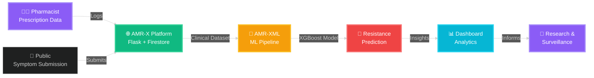

<div align="center">

<!-- Animated Header with Purple/Emerald Gradient -->


<!-- Dynamic Typing Animation -->


<br>

<!-- Social Badges with Glow Effect -->
<p>
  <a href="https://linkedin.com/in/joel-gijo-41007b359">
    
  </a>
  <a href="mailto:joelgijo03@gmail.com">
    
  </a>
  <a href="https://github.com/muadgijo">
    
  </a>
</p>

<!-- Animated Visitor Counter -->


</div>

---

<!-- Glowing Divider -->


<div align="center">

## 🧬 About Me

</div>

<table>
<tr>
<td width="50%" valign="top">

```yaml
name: Joel Gijo
role: CSE Undergrad | ML Researcher
focus: 
  - 🧬 Bioinformatics
  - 🤖 Machine Learning
  - 💊 Antimicrobial Resistance (AMR)
  
current_mission: |
  Building AMR-X — an ML-powered platform 
  to track and predict antibiotic resistance
  using real-world clinical data
  
learning_journey: 
  - Python → ML → Bioinformatics
  - XGBoost, PyTorch, Biopython
  - Building systems that inform research
  
scope: |
  ⚠️ Student research & engineering project. 
  Not intended for clinical diagnostic use.
  
philosophy: |
  "Code with purpose.  
   Build with impact. 
   Learn without limits."
```

</td>
<td width="50%" valign="top">

<div align="center">

### 🎯 Current Focus

<br>

```diff
+ 🧪 Predicting antibiotic resistance with XGBoost
+ 🤖 Training ML models on clinical microbiology data
+ 📊 Building interactive Streamlit dashboards
+ 🧬 Learning genomic sequence analysis
+ 🚀 Deploying production-ready ML pipelines
+ 📝 Contributing to open-source bioinformatics
```

<br>

### 🌱 Tech Arsenal


<br>


</div>

</td>
</tr>
</table>

---

<!-- Glowing Divider -->


<div align="center">

## ✨ Featured Project — AMR-X Ecosystem


</div>

<br>

<div align="center">

> **⚠️ Academic Research Project**  
> This ecosystem is built for **antimicrobial resistance research** and **decision-support education**.  
> Not validated for clinical diagnostic use.  Intended for research, learning, and public health informatics exploration.

</div>

<br>

<div align="center">

<table>
<tr>
<td width="50%" align="center" style="border:  2px solid #8B5CF6; border-radius: 10px;">


### 🌐 [AMR-X Platform](https://github.com/muadgijo/AMR-X)


<br>

**🎯 Core Features**
```
📝 Public symptom submission form
💊 Pharmacist prescription logging
📊 Live resistance dashboards  
🔐 Role-based authentication
🗄️ Cloud-based data storage
```

**🛠️ Tech Stack**
<br>


<br><br>

[](https://github.com/muadgijo/AMR-X)

</td>

<td width="50%" align="center" style="border: 2px solid #10B981; border-radius: 10px;">


### 🤖 [AMR-XML](https://github.com/muadgijo/amrxml)


<br>

**🎯 Core Features**
```
🧠 XGBoost resistance classifier
📈 ROC-AUC model evaluation
🎨 Interactive Streamlit UI
📦 Hugging Face datasets
🔬 Clinical data preprocessing
```

**🛠️ Tech Stack**
<br>


<br><br>

[](https://github.com/muadgijo/amrxml)

</td>
</tr>
</table>

</div>

<br>

<div align="center">



<sub>**Vision:** Track symptoms → Log prescriptions → Predict resistance → Inform research & public health decisions</sub>

</div>

---

<!-- Glowing Divider -->


<div align="center">

## 🔥 What I'm Working On Right Now

</div>

<br>

<table>
<tr>
<th width="33%" align="center">
   
  <br>📋 To-Do
</th>
<th width="33%" align="center">
  
  <br>🚧 In Progress
</th>
<th width="33%" align="center">
  
  <br>⏭️ Up Next
</th>
</tr>
<tr>
<td valign="top">

- [ ] AMR-X dataset cleanup
- [ ] Biopython basics course
- [ ] Documentation writing
- [ ] Unit test coverage
- [ ] Code refactoring
- [ ] Performance optimization

</td>
<td valign="top">

- [x] 🤖 Train baseline ML models
- [x] 📝 Write API documentation
- [x] 🎨 Streamlit UI polish
- [ ] 📊 Add evaluation metrics
- [ ] 🧪 Model hyperparameter tuning
- [ ] 🔍 Data validation pipeline

</td>
<td valign="top">

- [ ] 📱 Mobile symptom form
- [ ] 🔐 Pharmacist auth flow
- [ ] 🚀 Deploy to production
- [ ] 📈 Real-time analytics dashboard
- [ ] 🌐 REST API development
- [ ] 📚 Research paper writing

</td>
</tr>
</table>

---

<!-- Glowing Divider -->


<div align="center">

## 🛠️ Tech Stack & Skills

</div>

<br>

<div align="center">

### 🔥 Strong Foundation

<p>


</p>

### ✅ Comfortable With

<p>


</p>

### 🌱 Currently Learning

<p>


</p>

</div>

<br>

<!-- Skill Heatmap with Icons -->
<div align="center">

<details>
<summary><b>📊 Detailed Skills Breakdown (Click to Expand)</b></summary>

<br>

| Category | Technologies | Proficiency |
|: --------:|: ------------|:-----------:|
| **💻 Languages** | Python, C, SQL, Bash |  |
| **🤖 ML/DL** | PyTorch, XGBoost, scikit-learn, TensorFlow |  |
| **📊 Data Science** | Pandas, NumPy, Matplotlib, Seaborn |  |
| **🧬 Bioinformatics** | Biopython, Sequence Analysis, BLAST |  |
| **🌐 Web Dev** | Flask, HTML/CSS, Streamlit, REST APIs |  |
| **🗄️ Databases** | MySQL, Firestore, SQLite, PostgreSQL |  |
| **⚙️ DevOps** | Git, GitHub Actions, Docker, Linux |  |

</details>

</div>

---

<!-- Glowing Divider -->


<div align="center">

## 📊 GitHub Statistics

</div>

<br>

<div align="center">

<table>
<tr>
<td width="50%" align="center">


</td>
<td width="50%" align="center">


</td>
</tr>
</table>


<br>

<table>
<tr>
<td width="50%" align="center">


</td>
<td width="50%" align="center">


</td>
</tr>
</table>

</div>

---

<!-- Glowing Divider -->


<div align="center">

## 🎯 2026 Goals & Roadmap

</div>

<br>

<table>
<tr>
<td width="25%" align="center">

###  Q1 2026

- [x] ✅ Launch AMR-XML v1.0
- [ ] 📚 Complete Biopython course
- [ ] 📝 Publish research blog
- [ ] 🎨 Redesign portfolio

</td>
<td width="25%" align="center">

###  Q2 2026

- [ ] 🚀 Deploy AMR-X platform
- [ ] 📊 Add real-time analytics
- [ ] 🤝 Collaborate on bio projects
- [ ] 🧬 Build genomics tool

</td>
<td width="25%" align="center">

###  Q3 2026

- [ ] 🧬 Deep dive into genomics
- [ ] 🤖 Build sequence classifier
- [ ] 📚 Contribute to open source
- [ ] 🔬 Start research internship

</td>
<td width="25%" align="center">

###  Q4 2026

- [ ] 🎓 Complete ML specialization
- [ ] 🔬 Publish AMR research paper
- [ ] 🚀 Scale AMR-X ecosystem
- [ ] 🌐 Launch personal website

</td>
</tr>
</table>

---

<!-- Glowing Divider -->


<div align="center">

## 💡 Daily Inspiration

</div>

<br>

<div align="center">


<br><br>


</div>

---

<!-- Glowing Divider -->


<div align="center">

## 🤝 Let's Connect & Collaborate


</div>

<br>

<div align="center">

<table>
<tr>
<td align="center" width="25%">


**💼 Professional**

[](https://linkedin.com/in/joel-gijo-41007b359)

</td>
<td align="center" width="25%">


**📧 Email**

[](mailto:joelgijo03@gmail.com)

</td>
<td align="center" width="25%">


**💻 Code**

[](https://github.com/muadgijo)

</td>
<td align="center" width="25%">


**🌐 Portfolio**

[](#)

</td>
</tr>
</table>

</div>

---

<!-- Glowing Divider -->


<div align="center">

## ⭐ Show Some Love


<br>

<sub>If you like my work on AMR research, ML, or bioinformatics: </sub>

<br><br>

<p>
<a href="https://github.com/muadgijo?tab=repositories">
  
</a>
<a href="https://github.com/muadgijo?tab=followers">
  
</a>
<a href="https://github.com/muadgijo/AMR-X">
  
</a>
</p>

</div>

---

<!-- Animated Footer Wave -->
<div align="center">


<br>

<!-- Final Stats -->
<p>


</p>

<sub>**Built with ❤️ using Markdown, GitHub APIs, and caffeine**</sub>

<br>


<sub>*Last Updated: January 2026 • Made with purpose, built with passion*</sub>

</div>
