<div align="center">

<!-- Animated Header with Gradient Wave -->


<!-- Dynamic Typing Animation -->


<!-- Social Badges -->
<p>
  <a href="https://linkedin.com/in/joel-gijo-41007b359">
    
  </a>
  <a href="mailto:joelgijo03@gmail.com">
    
  </a>
  <a href="https://github.com/muadgijo">
    
  </a>
</p>

<!-- Visitor Counter -->


</div>

---

<div align="center">

## 🧬 About Me

</div>

<table>
<tr>
<td width="50%">

```yaml
name: Joel Gijo
role: CSE Undergrad
focus: 
  - Bioinformatics
  - Machine Learning
  - Antibiotic Resistance Research
current_mission:  >
  Building AMR-X — a platform to track
  and predict antimicrobial resistance
  using ML + real-world clinical data
learning_path:
  - Python → ML → Bioinformatics
  - XGBoost, PyTorch, Biopython
motto: "Code that saves lives"
```

</td>
<td width="50%">

<div align="center">

### 🎯 Current Focus

```diff
+ 🧪 Antibiotic resistance prediction
+ 🤖 Training ML models on clinical data
+ 📊 Building interactive dashboards
+ 🧬 Learning sequence analysis
+ 🚀 Deploying Streamlit apps
```

<br>

### 🌱 Growing In


</div>

</td>
</tr>
</table>

---

<div align="center">

## ✨ Featured Project — AMR-X Ecosystem


</div>

<div align="center">

<!-- Project Cards in Grid -->
<table>
<tr>
<td width="50%" align="center">

### 🌐 [AMR-X Platform](https://github.com/muadgijo/AMR-X)


**Core Features**
- 📝 Public symptom submission
- 💊 Pharmacist prescription logging  
- 📊 Live resistance dashboards
- 🔐 Authentication & role management

**Tech**  
`Python` `Flask` `Firestore` `HTML/CSS`

[](https://github.com/muadgijo/AMR-X)

</td>
<td width="50%" align="center">

### 🤖 [AMR-XML](https://github.com/muadgijo/amrxml)


**Core Features**
- 🧠 XGBoost resistance predictor
- 📈 ROC-AUC model evaluation
- 🎨 Interactive Streamlit UI
- 📦 Hugging Face dataset integration

**Tech**  
`Python` `XGBoost` `Streamlit` `scikit-learn`

[](https://github.com/muadgijo/amrxml)

</td>
</tr>
</table>

</div>

<div align="center">



```mermaid
graph LR
    A[🧑‍⚕️ Pharmacist] -->|Logs Data| B[AMR-X Platform]
    C[👤 Public] -->|Submits Symptoms| B
    B -->|Clinical Data| D[AMR-XML ML Model]
    D -->|Predictions| E[📊 Dashboard]
    E -->|Insights| F[🔬 Research & Surveillance]
    
    style B fill:#e3f2fd
    style D fill:#fff3e0
    style E fill:#f3e5f5
```

**Vision:** Track symptoms → Log prescriptions → Predict resistance → Inform decisions

</div>

---

<div align="center">

## 🔥 What I'm Working On Right Now

</div>

<table>
<tr>
<th width="33%">📋 To-Do</th>
<th width="33%">🚧 In Progress</th>
<th width="33%">⏭️ Up Next</th>
</tr>
<tr>
<td valign="top">

- AMR-X dataset cleanup
- Biopython basics course
- Documentation writing
- Unit test coverage

</td>
<td valign="top">

- 🤖 Train baseline ML models
- 📝 Write API docs
- 🎨 Streamlit UI polish
- 📊 Add evaluation metrics

</td>
<td valign="top">

- 📱 Mobile symptom form
- 🔐 Pharmacist auth flow  
- 🚀 Deploy to production
- 📈 Real-time analytics

</td>
</tr>
</table>

---

<div align="center">

## 🛠️ Tech Stack & Skills

</div>

<!-- Skills Section with Visual Categories -->
<div align="center">

### 🔥 Strong Foundation

<p>


</p>

### ✅ Comfortable With

<p>


</p>

### 🌱 Currently Learning

<p>


</p>

</div>

<!-- Skill Heatmap Table -->
<div align="center">

<details>
<summary><b>📊 Detailed Skills Breakdown</b></summary>

<br>

| Category | Technologies | Proficiency |
|----------|-------------|-------------|
| **Languages** | Python, C, SQL |  |
| **ML/DL** | PyTorch, XGBoost, scikit-learn |  |
| **Data Science** | Pandas, NumPy, Matplotlib |  |
| **Bioinformatics** | Biopython, Sequence Analysis |  |
| **Web Dev** | Flask, HTML/CSS, Streamlit |  |
| **Databases** | MySQL, Firestore, SQLite |  |
| **DevOps** | Git, GitHub, Linux, Docker |  |

</details>

</div>

---

<div align="center">

## 📊 GitHub Statistics

</div>

<div align="center">

<!-- Stats Cards in Grid -->
<table>
<tr>
<td width="50%">


</td>
<td width="50%">


</td>
</tr>
<tr>
<td colspan="2" align="center">


</td>
</tr>
<tr>
<td width="50%" align="center">


</td>
<td width="50%" align="center">

<!-- GitHub Trophies -->


</td>
</tr>
</table>

</div>

---

<div align="center">

## 🎨 Contribution Activity

</div>

<div align="center">

<!-- GitHub Contribution Snake -->
<picture>
  <source media="(prefers-color-scheme: dark)" srcset="https://raw.githubusercontent.com/muadgijo/muadgijo/output/github-contribution-grid-snake-dark.svg">
  <source media="(prefers-color-scheme: light)" srcset="https://raw.githubusercontent.com/muadgijo/muadgijo/output/github-contribution-grid-snake. svg">
  
</picture>

<sub>🐍 Contributions getting eaten by a snake</sub>

</div>

---

<div align="center">

## 🎯 2026 Goals & Roadmap

</div>

<table>
<tr>
<td width="25%" align="center">

### Q1 2026
- ✅ Launch AMR-XML v1.0
- 🚧 Complete Biopython course
- 📝 Publish research blog

</td>
<td width="25%" align="center">

### Q2 2026
- 🎯 Deploy AMR-X platform
- 📊 Add real-time analytics
- 🤝 Collaborate on bio projects

</td>
<td width="25%" align="center">

### Q3 2026
- 🧬 Deep dive into genomics
- 🤖 Build sequence classifier
- 📚 Contribute to open source

</td>
<td width="25%" align="center">

### Q4 2026
- 🎓 Complete ML specialization
- 🔬 Publish AMR research paper
- 🚀 Scale AMR-X ecosystem

</td>
</tr>
</table>

---

<div align="center">

## 💡 Daily Inspiration

</div>

<div align="center">

<!-- Dev Quote -->


<!-- Random Dev Joke -->


</div>

---

<div align="center">

## 🤝 Let's Connect

</div>

<div align="center">

<table>
<tr>
<td align="center" width="25%">

### 💼 Professional

[](https://linkedin.com/in/joel-gijo-41007b359)

</td>
<td align="center" width="25%">

### 📧 Email

[](mailto:joelgijo03@gmail.com)

</td>
<td align="center" width="25%">

### 💻 Code

[](https://github.com/muadgijo)

</td>
<td align="center" width="25%">

### 🌐 Portfolio

[](#)

</td>
</tr>
</table>

</div>

---

<div align="center">

## ⭐ Show Some Love

<sub>If you like my work, consider: </sub>

<p>
<a href="https://github.com/muadgijo? tab=repositories">
  
</a>
<a href="https://github.com/muadgijo? tab=followers">
  
</a>
</p>

</div>

---

<div align="center">

<!-- Footer Wave -->


<!-- Visitor Counters -->
<p>


</p>

**Built with ❤️ using Markdown + GitHub APIs**

*Last Updated: January 2026*

</div>
